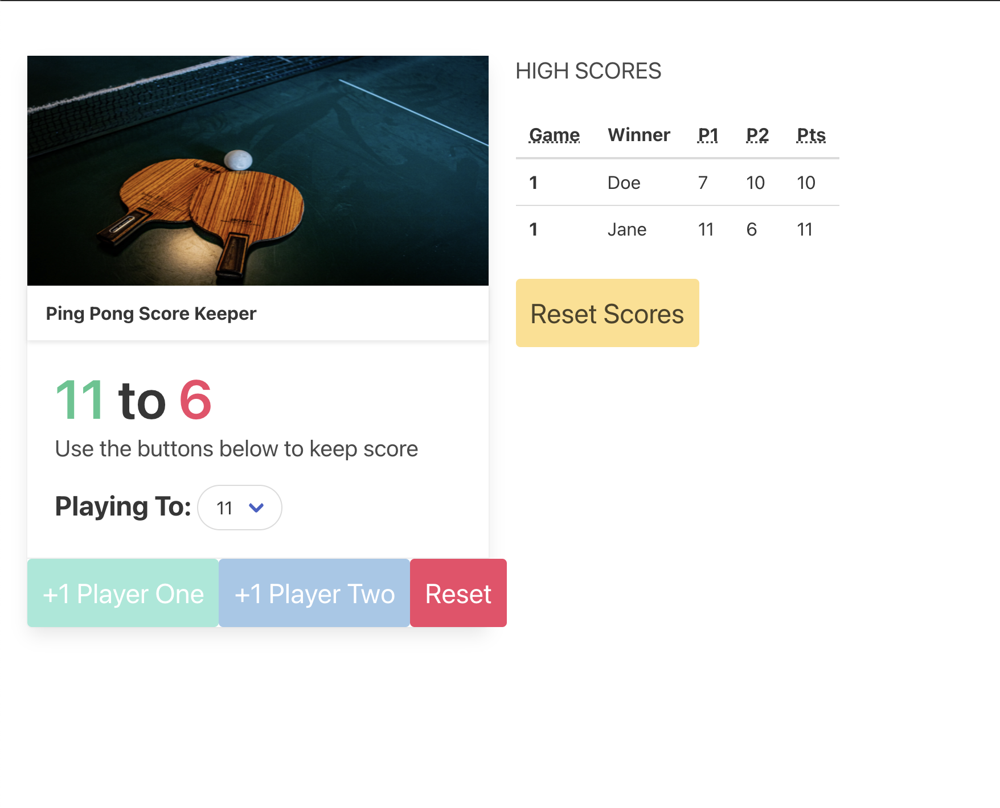

# Ping Pong Scorekeeper
This is a ping pong score keeper built using JavaScript. The scorekeeper has functionality to detect winner and keep track of winners and highscores. The front-end of this project was built using Bulma, HTML and CSS

## Play
- Set the number of plays at the start of the game.
- Double click on the score to remove

